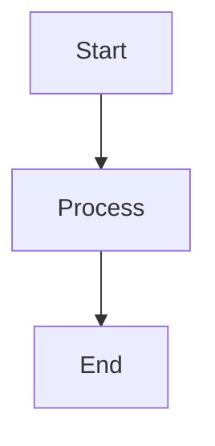

# Obsidian Flavored Markdown

Apply these rules ONLY when writing content that will be saved to an Obsidian vault via `obsidian` CLI commands (e.g., `obsidian create`, `obsidian append`, `obsidian daily:append`). Do NOT apply to general markdown files, READMEs, SKILL.md files, CLAUDE.md, or any non-vault output.

## Internal Links

### Use Wikilinks for Internal References

Always use wikilinks for links between vault notes. Never use standard markdown links for internal references.

```md
<!-- Incorrect -->
[Note Title](note-title.md)
[Display Text](folder/note.md)

<!-- Correct -->
[[Note Title]]
[[Note Title|Display Text]]
[[Note Title#Heading]]
[[Note Title#^block-id]]
```

### Embeds

Use `![[]]` syntax for embedding notes and images.

```md
![[Note Title]]
![[image.png|300]]
```

## Frontmatter

### YAML Properties

Always include a `tags` array. Add `aliases` when the note has alternate names.

```yaml
---
tags:
  - architecture
  - frontend
aliases:
  - Component Library RFC
---
```

## Tags

### Format

Tags support letters, numbers, underscores, hyphens, and forward slashes for nesting.

```md
#project-name
#domain/subdomain
#status/in_progress
```

Do not use spaces or special characters beyond `_`, `-`, `/`.

## Block References

### Block IDs

Add `^block-id` at the end of a paragraph to enable granular cross-referencing.

```md
The key insight is that demand aggregation must happen at the resource level. ^demand-key-insight

Link to it from another note: [[Planning Notes#^demand-key-insight]]
```

## Callouts

### Syntax

Use `> [!type] Title` with a blank line before the callout.

```md
> [!warning] Migration Required
> All existing records must be backfilled before enabling the new schema.

> [!tip] Performance
> Use batch queries when processing more than 100 records.

> [!info] Context
> This decision was made in the 2026-Q1 architecture review.
```

Common types: `note`, `tip`, `warning`, `info`, `example`, `danger`.

## Inline Formatting

### Highlighting

```md
==highlighted text==
```

### Comments

Hidden text not rendered in preview:

```md
%%This is a hidden comment%%
```

### Math

```md
Inline: $E = mc^2$

Block:
$$
\sum_{i=1}^{n} x_i
$$
```

### Mermaid Diagrams

Use fenced code blocks with `mermaid` language tag:

````md

````
